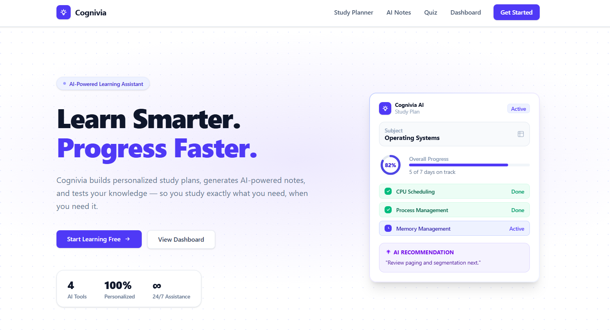
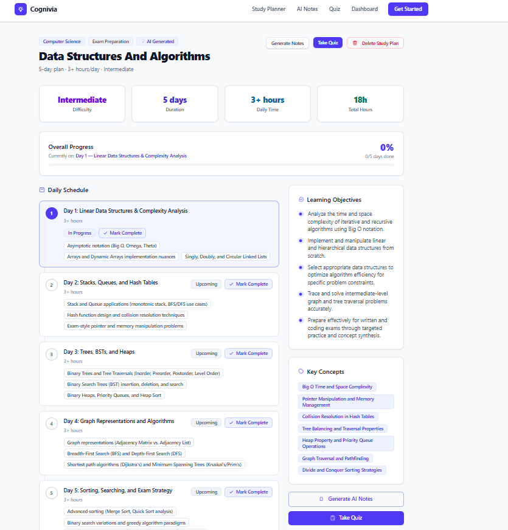
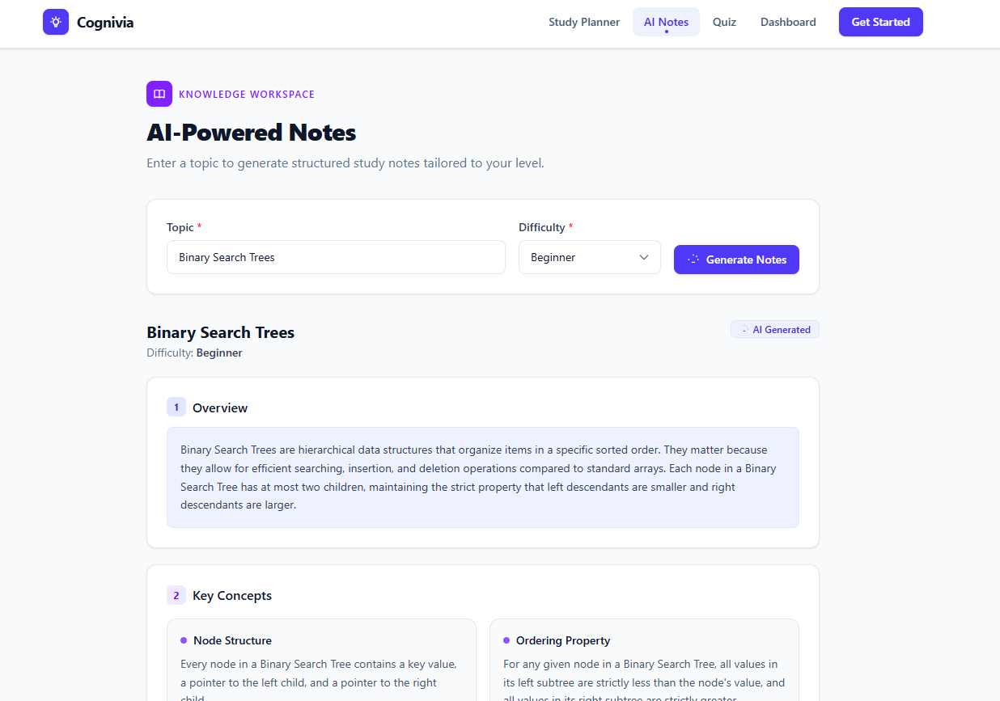
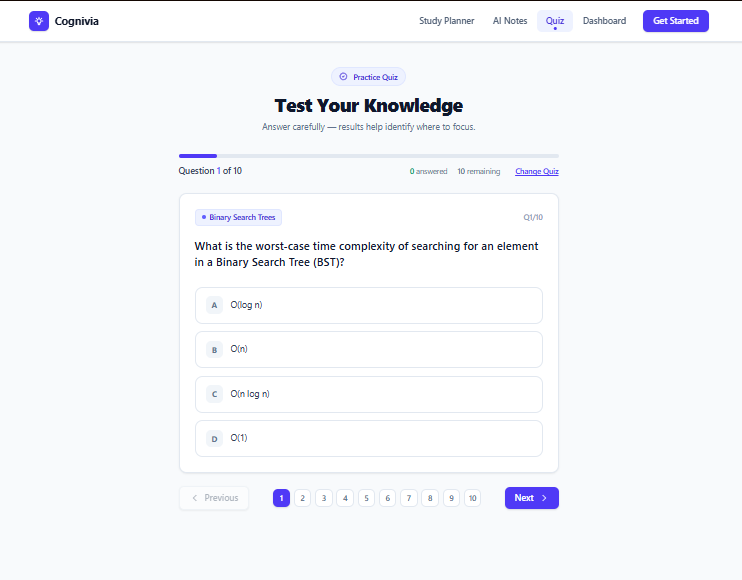

<div align="center">

# 🧠 Cognivia

### Learn Smarter. Progress Faster.

An AI-powered personalized learning assistant that helps students  
**plan, learn, practice, evaluate, and improve** — all in one place.

<br>

<a href="https://cognivia-ivory.vercel.app/">
  
</a>

<a href="https://github.com/TarunTXE/Cognivia">
  
</a>

<br><br>



</div>

---

## 📌 About Cognivia

**Cognivia** is an AI-powered personalized learning assistant designed to make studying more structured, interactive, and goal-oriented.

Students can provide their subject, topic, available study duration, difficulty level, and learning goal. Cognivia then generates personalized learning content and helps track their progress.

The platform brings together:

**Planning → Learning → Practice → Evaluation → Improvement**

into one learning experience.

---

## ✨ Features

### 📚 Personalized Study Plans

Create customized study plans based on:

- Subject
- Topic
- Available duration
- Difficulty level
- Learning goal

Each generated plan includes structured daily schedules, learning objectives, and key concepts.

### 🤖 AI-Powered Learning

Cognivia uses the **Google Gemini API** to generate personalized learning content dynamically.

AI-powered functionality includes:

- Study plan generation
- Topic-specific notes
- Practice quizzes
- Learning recommendations

### 📝 AI Notes

Generate focused learning notes for a selected topic based on the learner's study context.

### 🧠 Interactive Quizzes

Generate quizzes based on the selected learning topic.

Users can:

- Attempt questions
- Submit answers
- View their score
- Review performance
- Identify topics that require additional practice

### 📊 Progress Dashboard

The dashboard provides a centralized overview of the learner's current learning progress.

It includes:

- Study-plan progress
- Completed study days
- Quiz history
- Weak topics
- Recommended actions

### 🎯 Weak Topic Identification

Quiz performance can be used to identify topics where additional revision may be useful.

### 💡 Personalized Recommendations

Cognivia provides recommendations based on the learner's current study plan and quiz performance.

### 💾 Persistent Progress

Study-plan progress and quiz history are stored using browser `localStorage`, allowing progress to persist between sessions without requiring an account in the current MVP.

---

# 🖥️ Screenshots

## Landing Page

<div align="center">


</div>

---

## Dashboard & Study Planner

<div align="center">



</div>

---

## AI Notes

<div align="center">



</div>

---

## Quiz

<div align="center">



</div>

---

# ⚙️ How It Works

```text
                         ┌───────────────────┐
                         │       User        │
                         └─────────┬─────────┘
                                   │
                                   ▼
                         ┌───────────────────┐
                         │   React Frontend  │
                         │      + Vite       │
                         └─────────┬─────────┘
                                   │
                                   ▼
                         ┌───────────────────┐
                         │  Express Backend  │
                         │      REST API     │
                         └─────────┬─────────┘
                                   │
                                   ▼
                         ┌───────────────────┐
                         │    Gemini API     │
                         │   AI Generation   │
                         └─────────┬─────────┘
                                   │
                                   ▼
                    ┌─────────────────────────────┐
                    │    Generated Learning      │
                    │         Content             │
                    └──────────────┬──────────────┘
                                   │
                  ┌────────────────┼────────────────┐
                  │                │                │
                  ▼                ▼                ▼
             Study Plan         AI Notes          Quiz
                  │                │                │
                  └────────────────┼────────────────┘
                                   │
                                   ▼
                         ┌───────────────────┐
                         │     Dashboard     │
                         │ Progress & Stats  │
                         └───────────────────┘